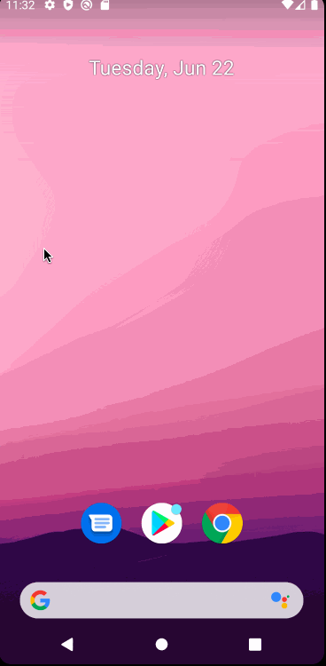

# Project 1 - Simple ToDoApp for Facebook CodePath

Simple ToDoApp is an android app that allows building a todo list and basic todo items management functionality including adding new items, editing and deleting an existing item.

Submitted by: **Nicholas Sean Gonzalez**

Time spent: **8** hours spent in total

## User Stories

The following **required** functionality is completed:

* [x] User can **view a list of todo items**
* [x] User can **successfully add and remove items** from the todo list
* [x] User's **list of items are persisted** across app restarts

The following **bonus** features are implemented:

* [x] User can **tap a todo item in the list and bring up an edit screen for the todo item** and then have any changes to the text reflected back in the todo list

The following **additional** features are implemented:

* [ ] List anything else that you can get done to improve the app functionality!

## Video Walkthrough

Here's a walkthrough of implemented user stories:

GIF created with [Kap](https://getkap.co/).

## Notes

Describe any challenges encountered while building the app.

A challenge was the time constraint and rapid ramp up to the tech stack. We had to get used to Github, Android Studio, and 
many other areas at the same time we were supposed to develop everything in one day.

I prioritized things in order and was able to thoroughly learn the tools we need rather than rush through them since we will need them for the future.
I was also able to complete the whole bonus activity and turn it in.

## License

    Copyright [2021] [Nicholas Sean Gonzalez]

    Licensed under the Apache License, Version 2.0 (the "License");
    you may not use this file except in compliance with the License.
    You may obtain a copy of the License at

        http://www.apache.org/licenses/LICENSE-2.0

    Unless required by applicable law or agreed to in writing, software
    distributed under the License is distributed on an "AS IS" BASIS,
    WITHOUT WARRANTIES OR CONDITIONS OF ANY KIND, either express or implied.
    See the License for the specific language governing permissions and
    limitations under the License.
